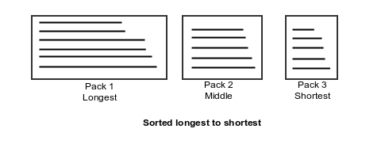

# Software Test Program

The purpose of this program is to see how you design and implement a real world problem. 

We are interested in your design, techniques used and how you implemented it in the program. Attempt to use a design appropriate for the problem at hand. 

## Pack Planner

The pack planner is simply a program that takes a list of items and sorts them into several packs \(groups\). 

An Item contains

1. Item id

2. Length \(mm\)

3. Quantity

4. Item Weight \(kg, the weight of one item\)

A Pack has:

1. Pack id

2. List of Items

The Packs are created with **one** of the following criteria 

1. Packing items from shortest to longest. 

2. Packing items from longest to shortest. 

3. Packing items in the order they were given. 

Program limitations 
1. Max weight allowed in any pack 
2. Max items in any pack 
3. Pack Sort Order Sort orders are: `NATURAL`, `SHORT_TO_LONG`, `LONG_TO_SHORT`

Natural refers to the order they were given as input. 

**Special Note**

1. Items can be split across packs. \(5 x 1000 pieces can be split so that 2 x 1000 are in pack A and 3 x 1000 are in pack B\)

2. Items are stacked **one on top of the other** forming a **stack** which is referred to as a Pack. 

## Visual Example

A Pack is a stack of Items, one on top of the other. 



## The Task

Create a program that takes as standard input the max pack weight, max items per pack and a list of items. As output it returns a list of packs

We will be feeding in our own input into your program and running the output through a validation checker. 

Page 1

\#Input format:
```txt
\[Sort order\],\[max pieces per pack\],\[max weight per pack\]
\[item id\],\[item length\],\[item quantity\],\[piece weight\]
\[item id\],\[item length\],\[item quantity\],\[piece weight\]
\[item id\],\[item length\],\[item quantity\],\[piece weight\]
... 

\#Output format:
```txt
Pack number: \[pack number\]
\[item id\],\[item length\],\[item quantity\],\[piece weight\]
\[item id\],\[item length\],\[item quantity\],\[piece weight\]
Pack Length: \[pack length\], Pack Weight: \[pack weight\]
```

\#STD input example: \(input ends when an empty line is received or you reach the end of the input stream\)
```bash
NATURAL,40,500.0
1001,6200,30,9.653
2001,7200,50,11.21
```

\#Example output for the above input:
```bash
Pack Number: 1
1001,6200,30,9.653
2001,7200,10,11.21
Pack Length: 7200, Pack Weight: 401.69
Pack Number: 2
2001,7200,40,11.21
Pack Length: 7200, Pack Weight: 448.4
```
